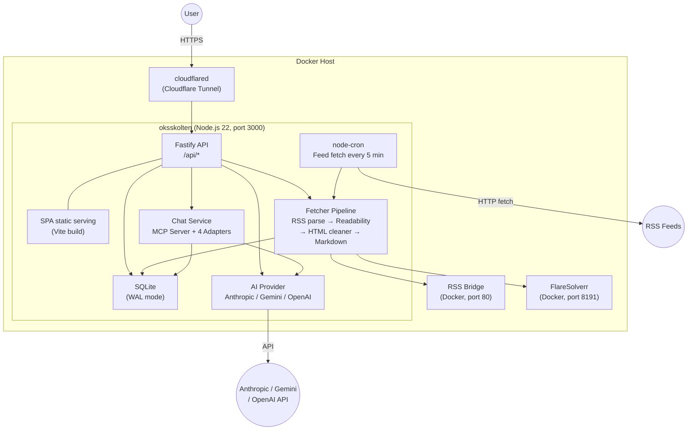

# Oksskolten Spec — Architecture

> [Back to Overview](./01_overview.md)

## System Overview



## Data Flow

### Article Ingestion (Cron: every 5 min)

```
1. Fetch enabled RSS feeds from the feeds table (disabled=0, type='rss')
2. Fetch & parse RSS/Atom/RDF (feedsmith → fast-xml-parser fallback)
   └─ Sites requiring bot auth → via FlareSolverr
   └─ If rss_bridge_url exists → via RSS Bridge
3. For each new article (semaphore: 5 concurrent):
   a. Fetch HTML → DOM parsing in Worker Thread (pre-clean → Readability → post-clean → Markdown)
   b. Extract OGP image & excerpt
   c. Language detection (CJK character ratio, local processing)
   d. INSERT into SQLite (on failure: record last_error, retry next cycle)
4. 5 consecutive failures → auto-disable feed (disabled=1)
```

### Article Viewing (On-demand)

```
1. User opens article → GET /api/articles/by-url
2. "Summary" tab → POST /api/articles/:id/summarize (SSE streaming)
   └─ Generate summary via LLM → cache in summary column
3. "Translation" tab → POST /api/articles/:id/translate (SSE streaming)
   └─ LLM or Google Translate → cache in full_text_ja column
4. Subsequent requests return from cache (no API calls)
```

### Authentication

```
3-method hybrid (at least one always active):
├─ Password: bcryptjs + JWT (30-day expiry)
├─ Passkey: WebAuthn (@simplewebauthn) + JWT
└─ GitHub OAuth: arctic + one-time exchange code → JWT
```

## Why This Architecture

Oksskolten is designed with the top priority of "just works with `docker compose up`". No external database, no external queue service, no external cron service. Everything fits in a single container.

### Why SQLite

We chose SQLite over PostgreSQL or MySQL.

- **Zero external dependencies**: No database server to start or manage. A single file is the entire database
- **Easy backups**: Just copy `data/rss.db`. No need for tools like `pg_dump`
- **Sufficient performance**: SQLite's WAL mode handles read/write performance without issues for a personal/small-team RSS reader
- **Easy migration**: SQLite files can be moved directly to another machine

### Why a Single Container

API server, SPA serving, and cron jobs coexist in a single process.

- **Single docker compose service**: A multi-container setup like `web` + `db` + `worker` is overkill for a personal tool
- **No IPC needed**: Cron jobs write directly to the DB. No message queues or worker processes in between
- **Low resource consumption**: Runs on low-spec environments like NAS, VPS, or Raspberry Pi
- **Worker Threads protect the event loop**: jsdom + Readability used in cron article fetching are CPU-intensive synchronous operations, but they run in a piscina Worker Thread pool (max 2 threads), so the API event loop is never blocked

### Why React SPA

We chose React SPA (Vite build) over Next.js or Remix.

- **Minimal server dependency**: Just serve pre-built static files. No frontend runtime needed on the server
- **Easy to fork**: Users who want a different frontend can use the API and build their own UI
- **No SSR needed**: A login-required personal tool has no SEO requirements. SPA is sufficient

### Alternatives Considered

| Architecture | Why Not |
|---|---|
| Vercel + Serverless | Can't use SQLite. Adds external DB dependency, losing the simplicity of self-hosting |
| Edge (Cloudflare Workers, etc.) | Can't have persistent processes, so cron won't work. API execution time limits conflict with summarization/translation |
| Next.js / Remix | Overkill for a personal tool that doesn't need SSR. Vercel-centric design philosophy doesn't align well with self-hosting |
| htmx | UI complexity (context menus, infinite scroll, streaming display) exceeds htmx's sweet spot |
| Microservices / Queue | Distributed systems are overkill for a personal RSS reader. A single process is simpler to operate and debug |
